# Project #4 Jimbo's Burgers

This application is a restaurant booking system for Jimbo's Burgers.
A fictional burger joint, using my own name, burger names and the location of Everton FC as my address.
Customers can register using an Username and password, and may then reserve a table for a number of people, on a date in the future at a certain time.

[Website - Jimbo's Burgers](https://jimbos-burgers-1bc3648c20fd.herokuapp.com/)

 - AM I RESPONSIVE

## Contents
- [Goals]
- [Scope and Features]
- [Planning]
- [Wireframes]
- User Stories
- Setup
- Authentication
- Booking
- Deployment
- Testing
- Documentation
- Credits
 ---

## Goals

    The application is to allow users to register with an email address and a password, and then they will be able to create a restaurant reservation.
    They will be able to subsequently edit or delete their own reservation(s).
    Staff users will be able to create reservations for customers, and will have authority to edit or delete any customers' reservations.

---

## Scope and Features

    Some features are only available to users with an account, and staff can access everything
    Responsiveness - the site is viewable on all devices, as tested

---
### Planning

    Project planning was done with Agile methodologies.

[Agile project](https://github.com/users/JaySanders95/projects/1/views/1)

## Wireframes
--- 

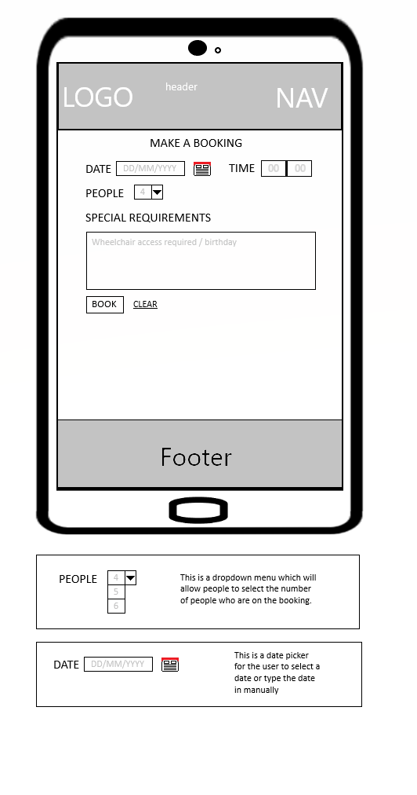

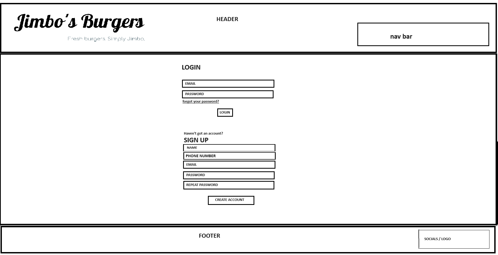
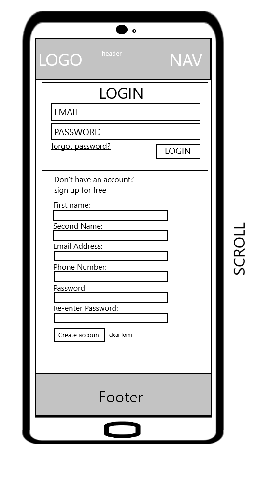

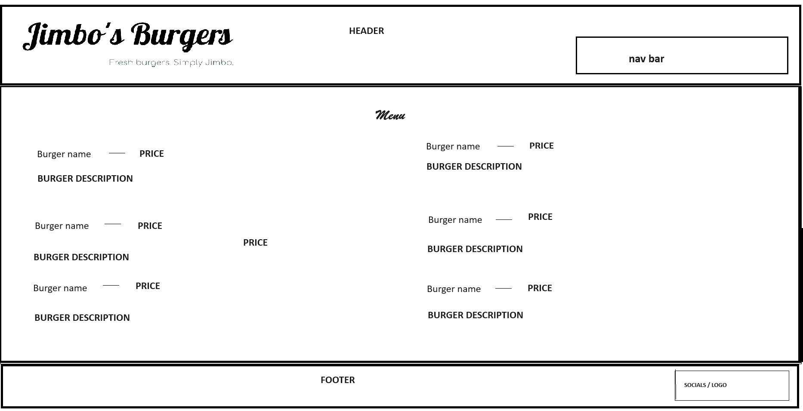
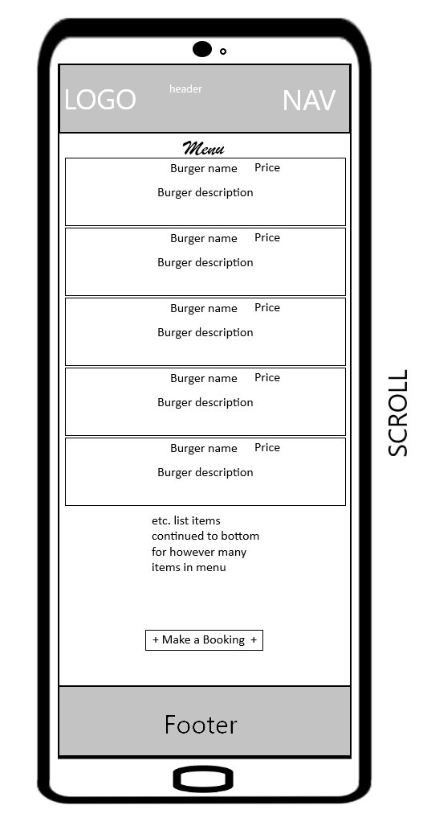

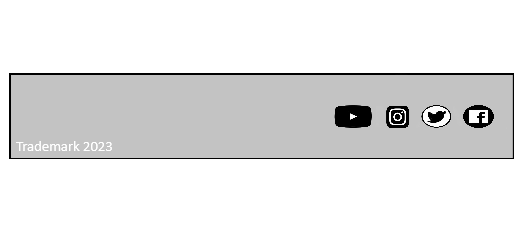

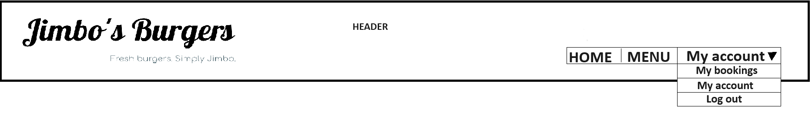
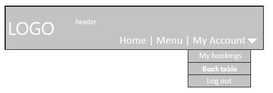

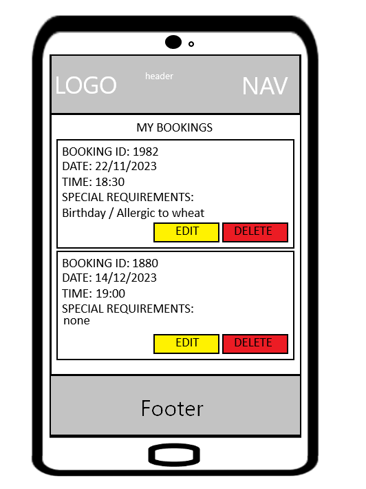
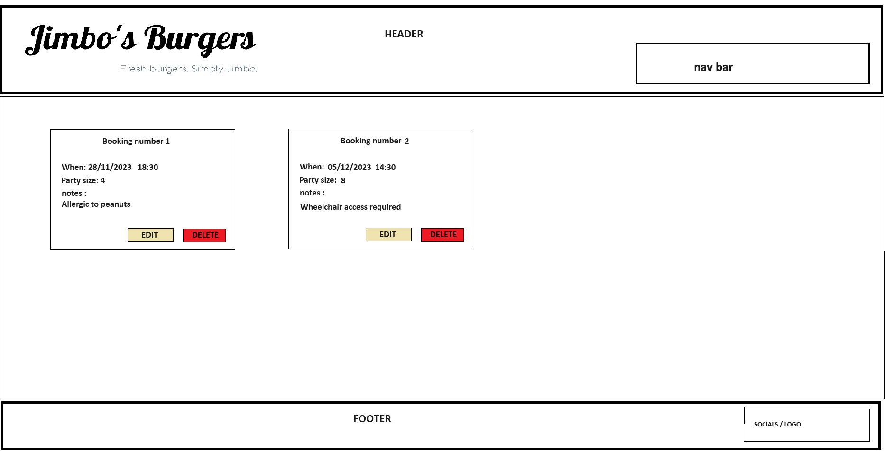

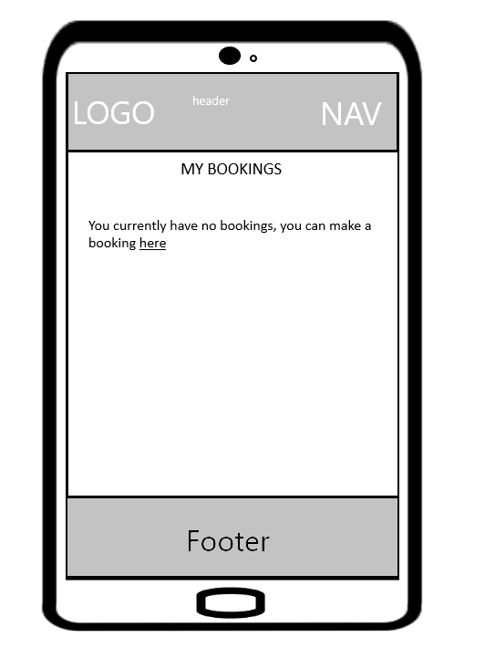

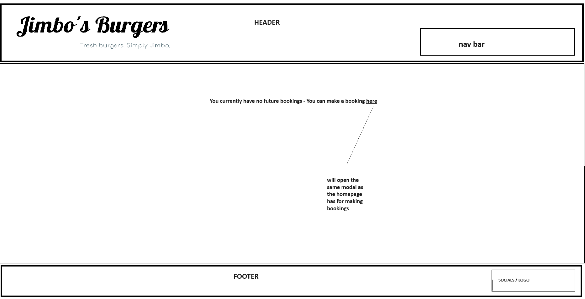

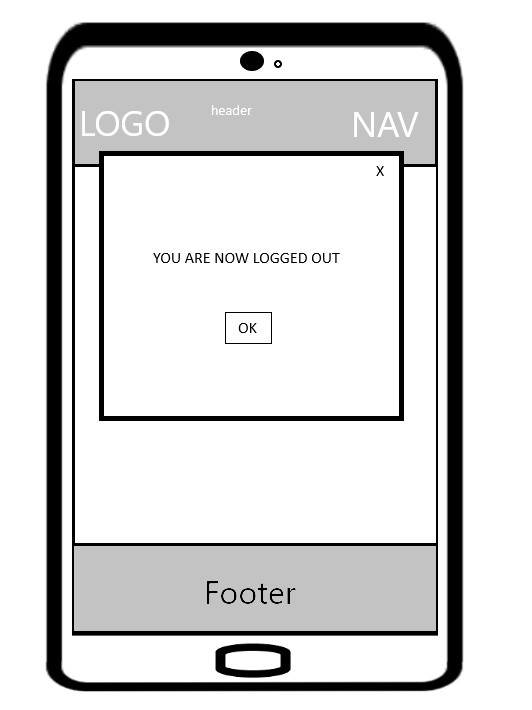
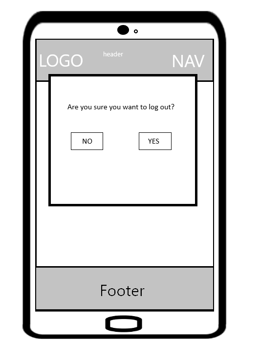

---

---

## User Stories

USER STORY - As a developer i must initialise a working environment so i can create my project
- Basic project setup
- Pip3 install 'django<4'
- Pip3 install 'django<4' gunicorn
- pip3 install dj_database_url==0.5.0 psycopg2
- pip3 install dj3-cloudinary-storage
- pip3 freeze --local > requirements.txt

## Setup
    This was to setup the system for development. Initialise the application, create the static resources needed by everything else.

``USER-STORY: - As a developer i must create and setup the default project basics so that the project may continue``
 - Basic project creation
    - pip install Django
    - jango-admin startproject main

``USER-STORY: - `As a developer, i must make the user provide a strong password so their account has added security``
- added security was placed on passwords so it could not be common, short, or without a number or capital letter.
 

``USER-STORY: - As a developer, i must create static resources to allow the app to inherit these``
 - Create base.html as a base for all other pages

``USER-STORY: - As a developer i must create a clean navigation system so users can easily browse the site.``

    Header:
        The header features a restaurant logo, with a varying number of links.
            
            Home:

            Only visible if logged in:
                Logout
		            Menu
                Book a Table
                My Bookings
                    (If the signed in user is staff, this link is "Bookings")

            Only visible if not logged in:
                Register
                Login
		
Logged in:
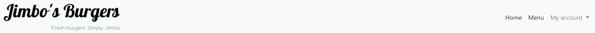
        
Not logged in:
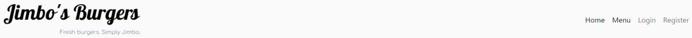
         

    Footer:
        The footer features the Restaurant address and Social media icons for Facebook, Instagram, Twitter and Youtube

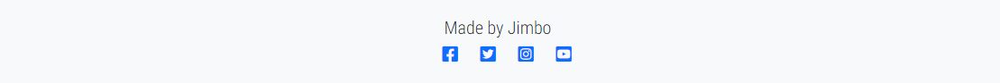

    Homepage:
        A new app is created for the home page - python manage.py startapp home
        The homepage is created in the home app in the templates/home directory, and imports the html from the base.html.
        The homepage features a simple  image with some welcome text, a google embed map for location and opening times.
        - The following files were edited to align with the website styling.
           - - signup.html
           - - login.html
           - - logout.html
           
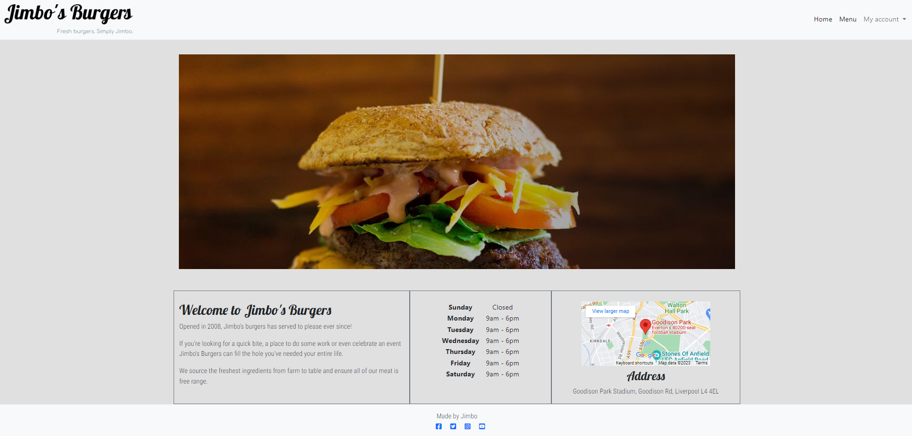

---

``USER-STORY: - As a developer, i must create http error pages to alert server issues and other HTTP server problems``

	404:
	a 400.html was created for page not found
	403:
	a 403 was created for forbidden

## Authentication
    Following the i think therefore i blog tutorial i installed allauth. copied it from the root directory and then modified to my own design. Allauth will manage registration, email verification, and login / logout functionality. 
            
``USER-STORY: - As a developer, i must add authentication so that only logged in users can create/read/update/delete bookings

if a user isnt logged in, they are redirected to the login page to continue.

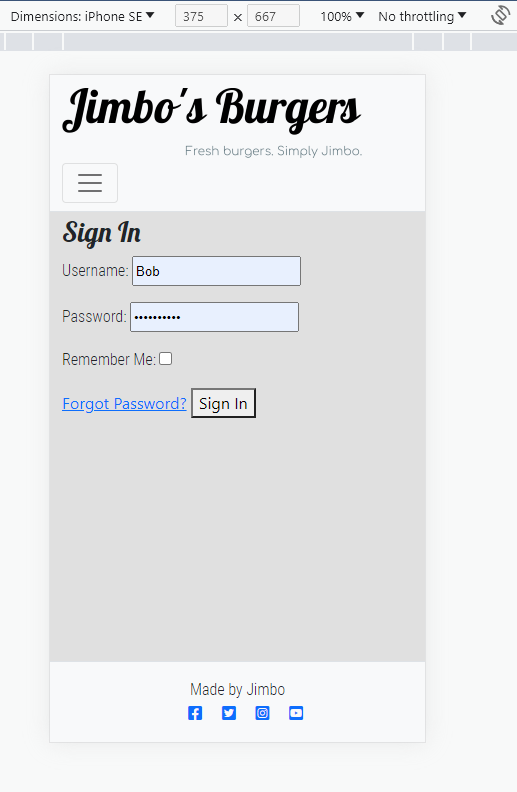

 ---

## Booking
    The bookings include all the functionality required to list/manage, create, edit and delete bookings.

``USER-STORY: - As a developer i must create databases that allow users to create, read, update and delete bookings``

``USER-STORY: - As a customer, I need a confirmation that my booking was successful``
 - confimation messages were added to inform changes, indicated by colour

    A page was added, with a corresponding view.

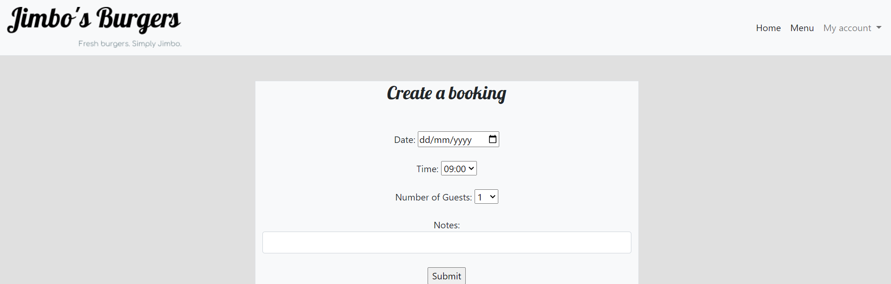
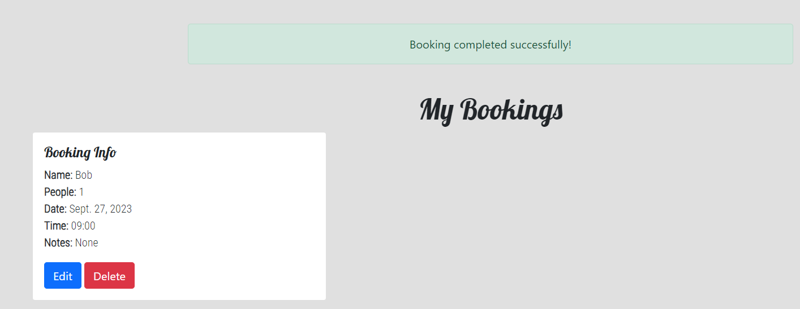

``USER-STORY: - As a user, i can see all bookings i have made to ensure they are correct and modify/delete if i need to,``
 - A page was added, with a corresponding view.

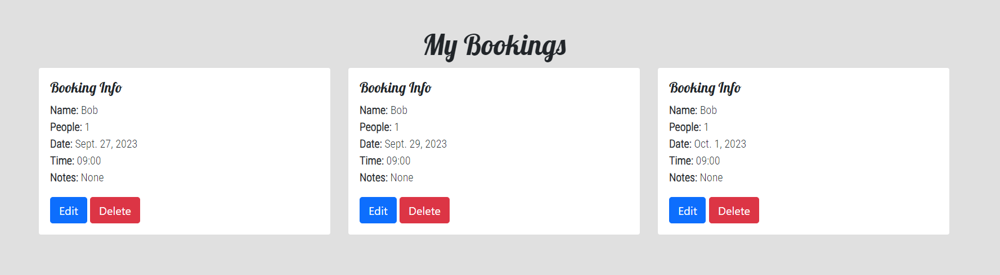
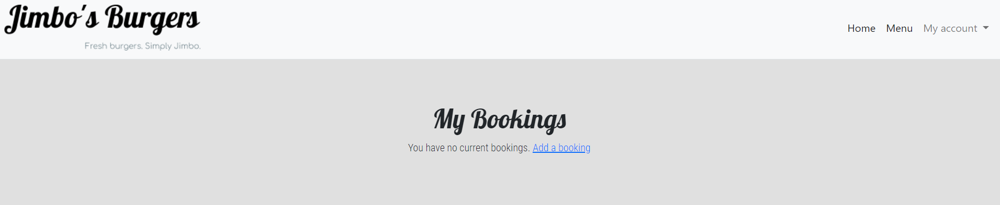

``USER-STORY: - As a user i can edit any current bookings i have``
 - A page was added, with a corresponding view.

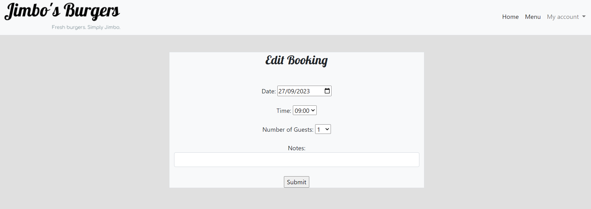
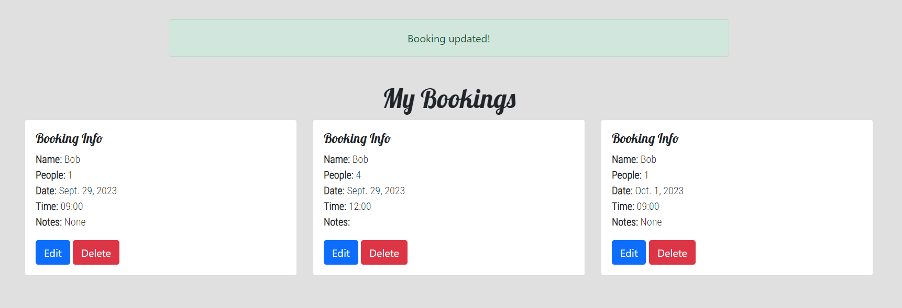

``USER-STORY: - As a user i can delete a booking if i no longer want it``
 - A page was added, with a corresponding view.

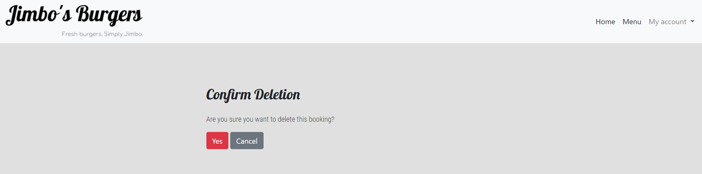
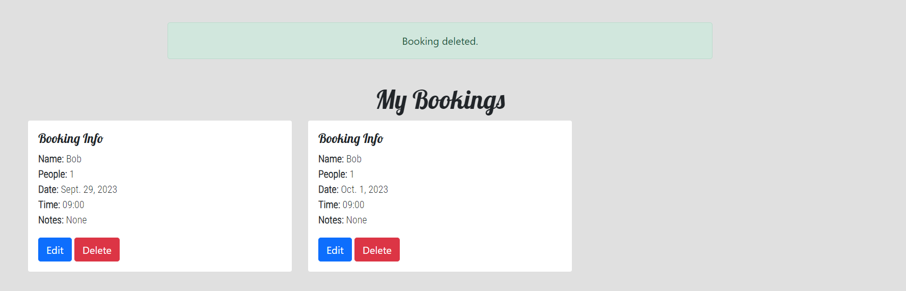

``USER-STORY: - ``USER-STORY: - as an admin i can create, edit and delete customers bookings so i can manage my restaurant``
 - When staff users are logged in, the filter that removes other users bookings is removed, so that Staff users can change any booking.

---

## Deployment

``USER-STORY: - As a developer, i must deploy to heroku to allow public access``

 - DATABASE_URL should have been populated by heroku
 - HEROKU_HOSTNAME - is the url which the app is deleivered by.
 - SECRET_KEY - is a string that the django application needs to run.

    - Go to the Deploy tab.
    - Connect to GitHub, sign in and connect to the required repository.
    - Scroll down to manual Deploy, select the main branch, and click deploy.

    [Website](https://jimbos-burgers-1bc3648c20fd.herokuapp.com/)

## Tests
 - Tests for the application.

``USER-STORY: - As a developer i must write suitable tests and perform manual testing so my code is working efficiently``
 
Automated Testing:

Models:
I ran tests using TestCase to ensure that the Models were functioning as designed.

For Table, i had the program:
- create a table
- check the string representation of the table i.e "table1"
- check the table fields (table number, capacity, availability)

For Booking, i had the program:
- Set up a test user, with username and password.
- Set up a table, using .object.create and created a table with 4 spaces and availability 4.
- Created a booking, using test user, created table, date, time (as integer set in tuple), num_guests 3 and notes.
- Then test the string representation of created booking i.e Covers: 3 Date: 2023-11-12.
- Then check the booking fields (customer, table, date, time, num_guests, notes).
- Then check the booking_time_display as this was converted in the booking model.

ALL PASSED

Views:
I ran tests using TestCase to ensure all views ran as designed.

For All views, i had the program create a user and a table for testing, then setup the self.factory to simulate requests

For CreateBooking:
- Created a request using factory to 'booking_add'
- Set user on request if logged in 
- Create a form instance
- Checks if the form is valid
- sets form
- Creates the view and dispatches
- Then checks the status code

Similar tests for ListBookings were completed but the template response was checked 'my_bookings'

for Editing bookings:

- Created a booking using the fields previously provided.
- Created a request
- Sets user on request if logged in
- Creates view and call dispatch
- Checks response code

for Deleting bookings:
- Creates booking
- Create request
- sets user
- creates view and calls dispatch
- checks response code

Some tests failed, but this was due to the working environment.
whilst testing i was advised to use the local sqlite database as it would not let me do it on postgresSQL. during these tests i had accidentally migrated and in attempt to undo this, deleted the migrations.
this would not allow me the tests to pass, but these were checked locally to ensure that they were correct

the correct reponse code was given for all views
the correct template was given for all views

During testing, i had to comment out the "messages" because middleware was not allowing this code to be checked so the tests were run without these.
messages were showing correctly when they were supposed to.

## Manual testing:

# User authentication:

During manual tests, i tried:

When a user visits the site, they are greeted with the option to view the menu, create an account or login to an existing account.

User-sign up:

During my testing, i tried to create an account:
- The field option for Username i tested:
  - If i could leave the option blank and this was not permitted
  - If i was allowed to create a username with invalid characters and this was not permitted
  - If i was allowed to create a username with blank space in the username and this was not permitted

- The field option for Password:
  - The password under 8 characters, no numbers and all lowercase and this was not permitted.
  - Password would also not allow any passwords too common i.e "password"
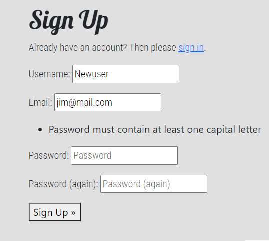
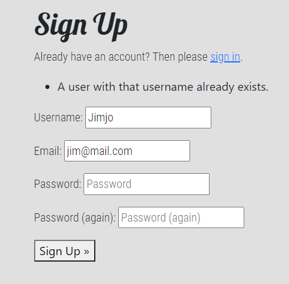
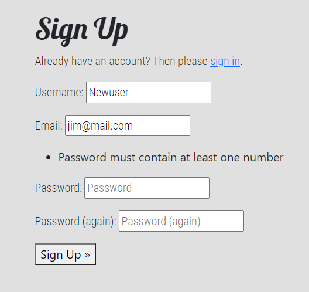
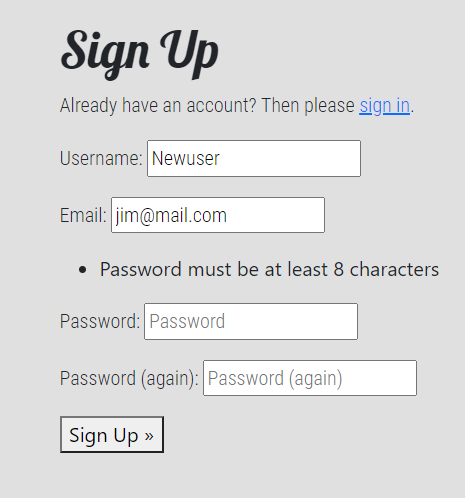

- The field option for Email:
  - If i could leave the option blank and this was not permitted
  - If i could add an email that was of an invalid type i.e @@ , this was not permitted

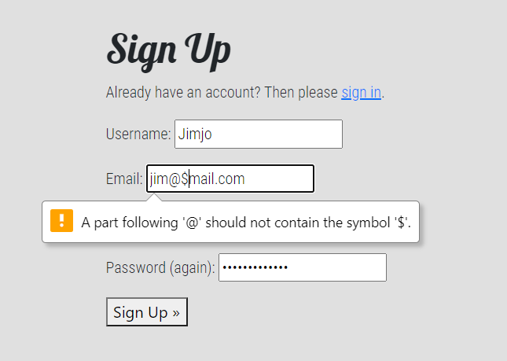
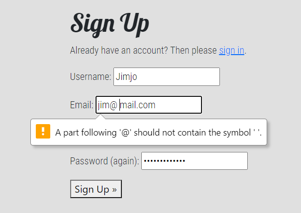

I created an account, with meeting the criteria for each and was permitted to use the site:

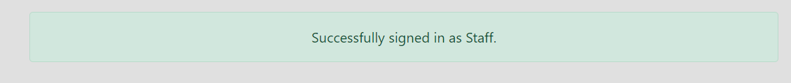
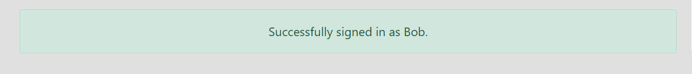
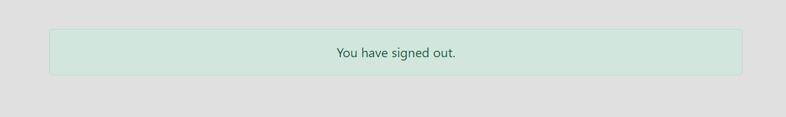

User functions (logged in~)

The user can Logout:
- They are redirected to the logout page

The user can view bookings:
- They are redirected to the my bookings page

The user can create bookings:
- They are redirected to the make a booking page

The user can view the menu
- They are redirected to the menu page

When the user visits the my bookings page:
- They are shown the bookings that they have currently made, displayed as cards or,
- They are shown plain text, stating they have no bookings and a link to the create booking page.

When the user visits the create booking page:
- They can create a booking if they are logged in

Booking-TESTING

During my testing, i tried to create bookings in different scenarios:

Scenario 1:

Logged out
people 3
time 4pm
date 12/12/2023

Upon attempting to visit this page at /bookings/add, i am redirected to the login page

Scenario 2:
Logged in 
people 5 
time 4pm 
date 12/12/23

Booking completed successfully
message to confirm booking displayed successfully

Scenario 3:
Logged in 
people 2
time 5pm
date 10/06/2023

Booking not created, message "you cant book tables in the past"

I then tried to book a table and not fill out required fields:
Time was required - could not confirm booking without this field completed
Date was required - could not confirm booking without this field completed
Number of guests was required - could not confirm booking without this field completed
Notes - Special characters were permitted, as they could be used in a sentence for notes (i.e "do you do 20% for Forces discount?")

Listed Bookings-TESTING:
When booking list was empty:
- Clicked on link to add a booking and it redirects to the correct page

When bookings:
- Bookings show in date ordered from earliest
- I can click to edit the booking, which redirects me to "edit_booking" page
- I can click to delete the booking, which redirects me to "booking_defensive" page

Editing-TESTING
I tested to book a table different from the one that i had made, and the details were updated and i was redirected back to my bookings with the newest information showing.
I selected a new date, new party size new time and this was completed.

Delete-TESTING
I tested the delete button on my_bookings
once clicked, redirects me to the booking_defensive page
from there i am asked am i sure that i want to delete booking
clicking the YES option deletes the booking and redirects user to my bookings page
clicking NO, redirects and no changes are made

---

USER-STORY: - As a developer I can complete README.md so that the project is documented
 - This file is the documentation for the project.

---

## Website Design

 - Colours
   - The colour scheme for this project consisted of bootstrap's bg-light, this was used for info boxes such as the welcome message, the navbar, the footer.
   - This was contrasted with a greyscale background for the body and black text. 

 - Fonts
     - The font used for the logo was Lobster, this was also used for all h1, h2, h3, h4 and h5.
     - The font used for all other text was Roboto condensed
     - These were taken from Google Fonts and added to the top of my style.css as an @import

 - Logo
    - A free logo was created at LOGO.COM

 - Hero Images
    - The hero image was taken from google free stock photos

## Device Testing
I tested all pages on different response sizes using chrome developer tools:

- displayed correctly on all pages - IPHONE
- displayed correctly on all pages - ANDROID
- displayed correctly on all pages - PC - chrome

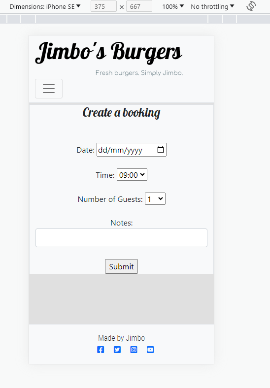
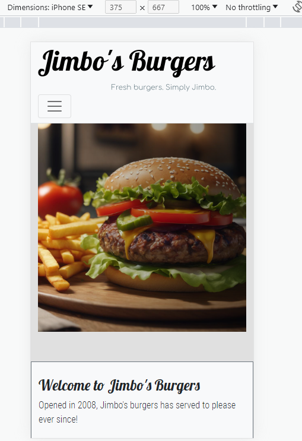

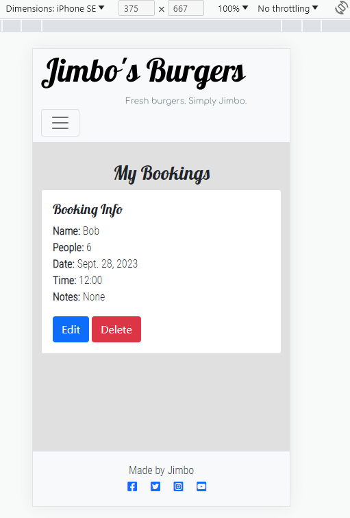
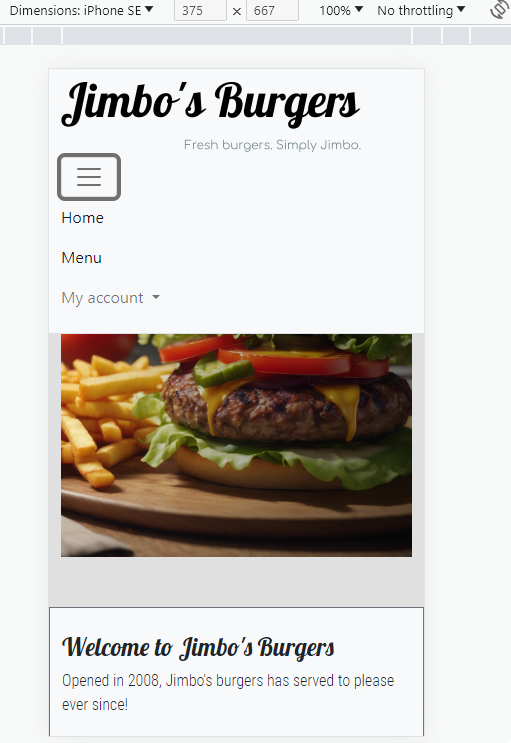
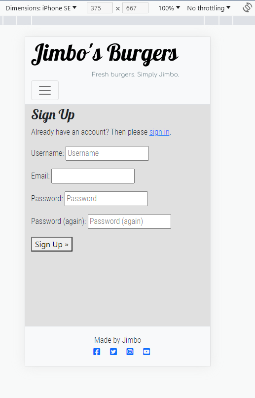
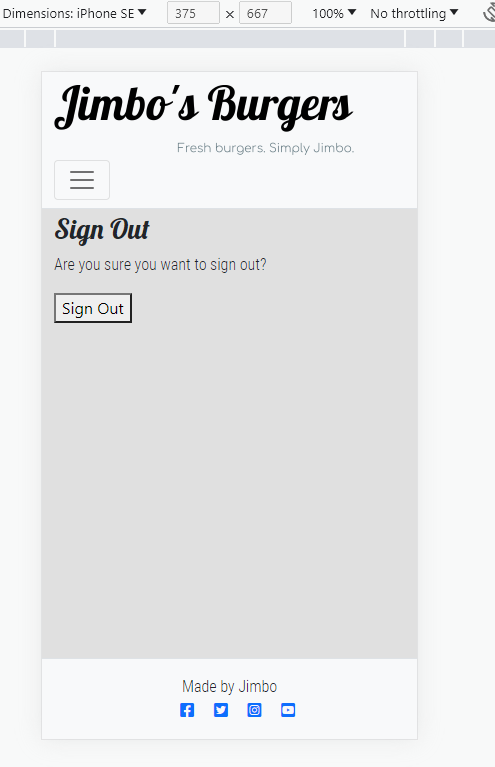

## Links
All links went to their correct destinations
including:
Logo - HOME
Home - HOME
Menu - MENU
Login - LOGIN
Register - SIGNUP
Logout - LOGOUT
Make Booking - MAKE BOOKING
My Bookings - MY BOOKINGS
Facebook - FACEBOOK
Twitter - TWITTER
Instagram - INSTAGRAM
YouTube - YOUTUBE

## Validation
W3 validator HTML

I validated code by direct input. 

Here are the steps i performed for my HTML documents:
- Opened page i wanted to validate i.e. base.html
- right click open "view page source"
- CTRL + A to select all and pasted into validator

base - NO ERRORS
menu - NO ERRORS
my_bookings - NO ERRORS
booking_add - 2 MINOR ERRORS ID states empty but ID = {{ form.num.guests.id_for_label }}
booking_edit - 2 MINOR ERRORS ID states empty but ID = {{ form.num.guests.id_for_label }}
booking_defensive - NO ERRORS
logout - NO ERRORS
login - NO ERRORS
register - NO ERRORS

W3 CSS validator results
NO ERRORS FOUND

For JSHint- only minor JS was used, so use for a script.js was not neccessary

PEP8 - CI LINTER at https://pep8ci.herokuapp.com/

bookings/
admin - NO ERRORS
apps - NO ERRORS
forms - 1 error for line exceeding 79 characters, nothing can be done to fix this issue as is class name + parameters
models - NO ERRORS
forms - 1 error import line too long, nothing can be done to fix this as need to import multiple 
views - 1 error import line too long

home/
apps - NO ERRORS
forms - NO ERRORS
views - NO ERRORS
settings - minor errors from default

Lighthouse:

scores for lighthouse:
all pages were checked and received consistent scores except the home page, which received good scores except best practise, but this was due to fonts and other minor issues.

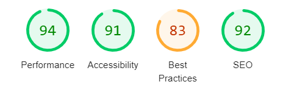
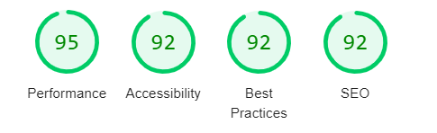
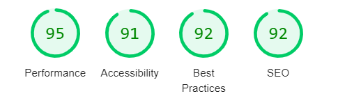
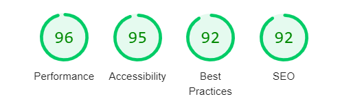

## Credits
The CI tutors who helped with bugs/queries that i had faced, these include:
- Not being able to test correctly, and issues in code preventing this
- Problems with why bookings would not submit to database
- How to extend base.html to django-allauth pages
- Help with deploying my project to Heroku

I think therefore i blog for specific code and setup for project

NetNinja Youtube - https://www.youtube.com/watch?v=n-FTlQ7Djqc&list=PL4cUxeGkcC9ib4HsrXEYpQnTOTZE1x0uc
This was basic guides on everything that had already been covered but had different methodologies

I sought external tutoring to help me go over some parts of the code, as i was time-restraint to 90 minutes per week for CI. 
I cannot thank enough to Chris Hoyle tutor who helped me with parts of my code. 
They helped with issues but did not provide large scale code for me to copy, such as:
- Devising how to write bookingform
- Why Views would work incorrectly
- Filepathing issues
- Converting tuple integer to human readable value
- Ideas on how to tackle upcoming issues

